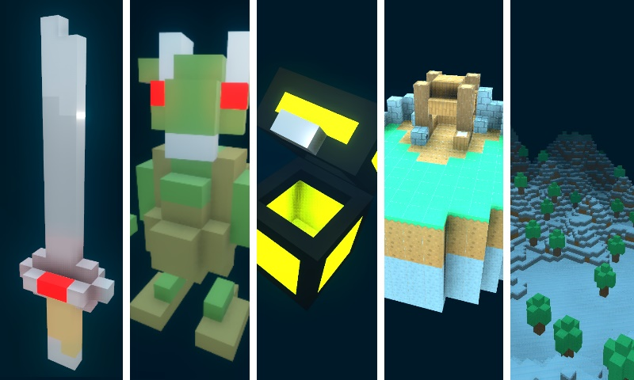

<h1 align="center">
	<a href="https://github.com/ClarkThyLord/Voxel-Core">
		
		 
		Voxel-Core
	</a>
</h1>

	
	
	
	

> Voxel plugin for the Godot game engine!

---

	

# About
Voxel-Core is a voxel plugin for the [Godot](https://github.com/godotengine/godot) game engine made with GDScript, created as the ‘core’ for my other project [Voxly](https://github.com/ClarkThyLord/Voxly), offering various voxel features, utilities and fully fledged in-engine editors.

## Why Voxel-Core?
- Create, import and edit voxel content in-engine and in-game
- Runs anywhere Godot does (e.g. desktop, web, mobile, etc.)
- Great for voxel objects (e.g. characters, creatures, props, etc.)
- Designed to be easily extended, modify and expand Voxel-Core to meet your needs

## Features ([Video](https://youtu.be/cnHA7uZahp8))
- VoxelObject, is a new MeshInstance type that is used to visualize voxel content
	- Easily embed self-maintaining StaticBodies
	- Fully automatic UV Mapping, creating textured voxel content has never been easier
	- Meshing modes: naive meshing, for creating quick culled meshes; greedy meshing, for creating optimized meshes
- VoxelSet, a Resource, much like a TileSet, that stores voxels, textures and materials used by VoxelObjects
	- Create an almost infinite variety of voxels
	- Define SpatialMaterials and Shaders for one or more voxels
	- Set colors, textures, materials and more on a voxel or per face basis
- In-Engine Editors, making the creation and modification of voxel content a simple matter
	- Integrated keyboard shortcuts and undo/redo support throughout
	- VoxelObjectEditor, create and modify voxel content in-scene
		- Offers many operations, such as: adding, removing, swapping, filling and more
		- Apply operations individually, by area or by face / extrusion
		- Mirror operations over x, y and z axis
		- Import files, apply effects and more...
	- VoxelSetEditor, create, modify and manage your VoxelSets
		- Add, remove, duplicate voxels
		- Live interactive 3D and 2D voxel preview
		- Many options to get the specific look you want from your voxel
- Readers, used to import files as both static and dynamic voxel content
	- Fully integrated with the editor, automatically recognizes and imports files as voxel content
	- Image files (jpg, png, and any other supported raster format), quickly create 3D prototypes from 2D content
	- Vox files (MagicaVoxel), making it easy and simple to work back and forward between programs
	- Color palette files (images, vox, gpl, etc.), allows you to work with the same color palettes across platforms

# [Wiki / Usage](https://github.com/ClarkThyLord/Voxel-Core/wiki)

# Getting Voxel-Core
## Godot Asset Library ([Godot Doc](https://docs.godotengine.org/en/stable/tutorials/plugins/editor/installing_plugins.html))
Preferably, Voxel-Core is available in the [Godot Asset Library](https://godotengine.org/asset-library/asset/465), allowing you to add it directly to your project from within Godot. Create or open an existing project and press on the 'AssetLib' tab found at the top of the editor. Once the asset library has loaded, search for  '*Voxel-Core*'. The top result should be this plugin, press on it and you'll be given the option to download Voxel-Core. Press to download and once it's completed Godot will ask you to select what you'd like to install. If you only want the plugin then only select the `addons` folder, but you can also choose to install anything else in this repository such as the `examples` folder. 

## Clone / Download
If for whatever reason you don't want to or can't download Voxel-Core via the in-engine Godot asset library, then you can always clone or download this repository directly. Once you've cloned or downloaded this repository, you can import it directly into Godot as a project to view the various examples and edit them directly. You may as well move the plugin's folder directly into your own project’s `addons` folder.

**NOTE:** *After adding Voxel-Core to your project you'll need to activate it in your project's `Plugins` configuration!*
